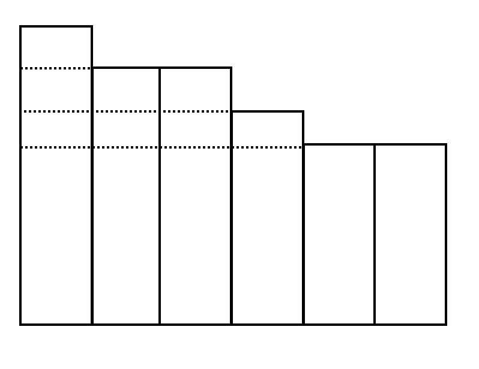

# variance

一个用于实现资金池最小方差的Kubernetes Operator.

## 问题描述

存在n个资金池P，比如{P1,P2,...Pn}，其中Pi为当前资金池的余额，且余额不一定相同；现在向资金池中进行支出一定的资金额度，比如f，f可以进行自由分割。现编写一个operator，定义资金池、支出作为两个自定义资源，实现从资金池支出功能。

目标：使支出的f能够从各个资金池中获取，支出完成后，资金池之间的差额达到最小（方差）。最终支出后可以容忍为负债状态，即Pi < 0。

## 算法描述

设fi为第i个资金池抽取的资金的数目，S为抽取完f之后资金池余额的平均数，根据方差的定义，可知我们的目标是调整fi，使得如下公式的值最小：


由于f为固定值，所以S始终保持不变。因此问题演变为如何调整fi，使得(Pi-fi)与固定值S的差的平方的和最小。最一般地，假设f的值为1，由如下公式可知，我们总是应当选择最大的Pi减去f=1，使得上面式子的结果下降地更快（事实上可以很容易地证明，我们选取的Pi永远不会小于S）。若有多个Pi都为最大值，则任选其一。


而f=n且n不为1的情况可以看作n次上述过程的重复。最终，本问题就转换成了如下问题：


将数组p1到pn构成一个直方图，从上往下进行截取，直到直方图以上的面积第一次大于等于f。

## 实现方法

本质上是从上往下逐步累加计算由相邻两条虚线构建的矩形的面积直到大于f，再依次计算各个pi需要减去的数值



具体实现中各个主要的变量为：
* 首先将p1到pn从大到小进行排序得到数组P

* 变量aggr为减去最多的pi的数值，它会在整个过程中逐步累加，每经过一个矩形，都加上该矩形的宽度。当遍历到最后一个矩形时，累加的值为f的剩余值除以该矩形的长度

* 变量remainder为遍历到最后一个矩形时，f的剩余值除以该矩形的长度的余数

遍历数组P (注：从index 1开始遍历直到len(P)):

* 若当前下标为len(P)，计算aggr和remainder并遍历结束

* 若当前下标的pi和上一个pi的高度不同，则出现一个新的矩形，计算该矩形的面积，若面积大于剩余的f值，则结束遍历，计算aggr和remainder；否则更新aggr，继续遍历

## 复杂度分析

可以看到，除了最初的排序以外，后续的操作都是线性地遍历，而各种排序算法中最好的复杂度可以达到O(nlogn)，因此本问题一般的复杂度最好可以为O(nlogn)

## 测试验证

在一个终端执行如下命令

```bash
# 注册CRD
make install

# 简单地运行operator
make run
```

在另一个终端执行如下命令

```
# 创建两个FundPool资源对象
kubectl apply -f config/samples/fundpool-1.yaml
kubectl apply -f config/samples/fundpool-2.yaml

# 确保上述两个FundPool已经存在的情况下，创建一个Supply资源对象
kubectl apply -f config/samples/supply-once.yaml
```

最终通过查看FundPool和Supply资源对象各实例等详情，可知结果符合预期
