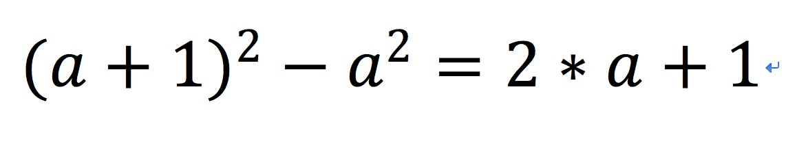

# variance

一个用于实现资金池最小方差的Kubernetes Operator.

## 问题描述

存在n个资金池P，比如{P1,P2,...Pn}，其中Pi为当前资金池的余额，且余额不一定相同；现在向资金池中进行支出一定的资金额度，比如f，f可以进行自由分割。现编写一个operator，定义资金池、支出作为两个自定义资源，实现从资金池支出功能。

目标：使支出的f能够从各个资金池中获取，支出完成后，资金池之间的差额达到最小（方差）。最终支出后可以容忍为负债状态，即Pi < 0。

## 算法描述

设fi为第i个资金池抽取的资金的数目，S为抽取完f之后资金池余额的平均数，根据方差的定义，可知我们的目标是调整fi，使得如下公式的值最小：

由于f为固定值，所以S始终保持不变。因此问题演变为如何调整fi，使得(Pi-fi)与固定值S的差的平方的和最小。最一般地，假设f的值为1，由如下公式可知，我们总是应当选择最大的Pi减去f=1，使得上面式子的结果下降地更快（事实上可以很容易地证明，我们选取的Pi永远不会小于S）。若有多个Pi都为最大值，则任选其一。

而f=n且n不为1的情况可以看作n次上述过程的重复。最终，本问题就转换成了如下问题：

将数组p1到pn构成一个直方图，从上往下进行截取，直到直方图以上的面积第一次大于等于f。

## 实现方法

首先将p1到pn从大到小进行排序得到数组M。遍历M，构建另外一个数组N，N[i]包含如下元素：

* M[i] - M[i+1]的差值delta
* 值为M[i]的各个pi
* aggr为M[0]到M[i-1]的delta的和

len为N[i]之前（包括i）所有出现过的pi的数目，最后遍历数组N，当处理N[i]时：

* 若(f - len * delta) > 0且len < n，则f = (f - len * delta)，继续遍历；否则遍历结束，记录下i；max = (aggr + f / len)；remainder = (f % len)。

最后初始化一个map，名字为result，它的key为pi的名字，value为pi应当减去的数值。再次遍历数组N到i，处理步骤如下：

* 将N[i]中的各个pi加入到result中且值为max - aggr

最后，在result中任意选择remainder个元素，将它们的值减1，result即为我们需要的结果

## 复杂度分析

可以看到，除了最初的排序以外，后续的操作都是线性地遍历，而各种排序算法中最好的复杂度可以达到O(nlogn)，因此本问题一般的复杂度最好可以为O(nlogn)
